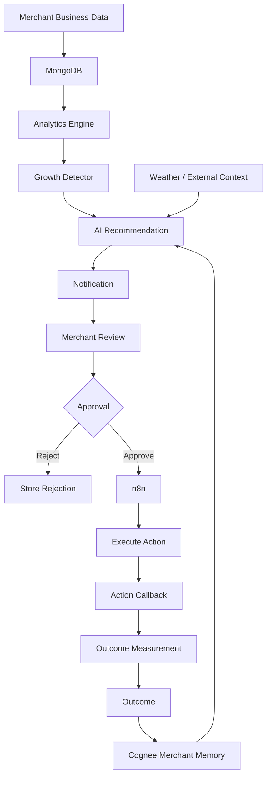
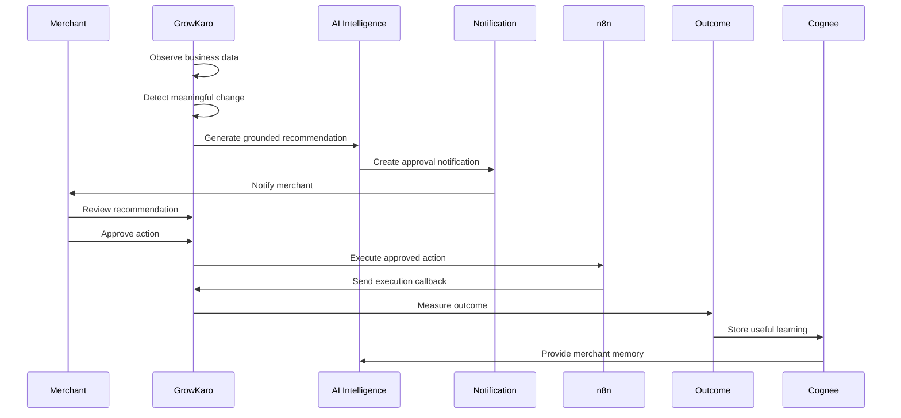

# GrowKaro — Clean Demo Workflow & Production Architecture
## The Autonomous AI Business Partner for Digital-Payment Merchants

---

## 1. Product Purpose

GrowKaro is an autonomous, agentic AI business partner for retail merchants, cafes, and local service businesses that transact via digital payments (UPI, QR codes, POS, and cards).

Small business owners process hundreds of transactions daily, but rarely have the time, technical tools, or data science expertise to analyze hourly lulls, customer attrition, product shifts, or the impact of weather. Traditional merchant dashboards merely present passive charts.

GrowKaro completes the entire autonomous loop:

$$\mathbf{Observe} \longrightarrow \mathbf{Understand} \longrightarrow \mathbf{Detect} \longrightarrow \mathbf{Recommend} \longrightarrow \mathbf{Notify} \longrightarrow \mathbf{Approve} \longrightarrow \mathbf{Act} \longrightarrow \mathbf{Measure} \longrightarrow \mathbf{Learn}$$

It proactively monitors business data, detects critical patterns and revenue opportunities, generates grounded actions, notifies the merchant for approval, dispatches automated campaigns through n8n workflows, measures deterministic outcomes, and learns continuously via persistent business memory.

---

## 2. Real-World Merchant Scenario

**Merchant:** Cafe Aroma (Specialty Coffee & Bakery, Indiranagar, Bengaluru)  
**Business Profile:** High-volume suburban cafe experiencing strong morning peaks and evening weekend crowds, but suffering from a recurring mid-day weekday slump between 2:00 PM and 4:30 PM.

### The Business Challenge
- From 2:00 PM to 4:30 PM on Tuesdays and Wednesdays, footfall drops by 31% below standard weekday baselines.
- Espresso machines sit idle, baristas are underutilized, and perishable morning pastries risk being wasted.
- The merchant knows mid-day is slow, but lacks the time to draft compelling offers, select target audiences, and broadcast campaigns at the optimal moment.

### How GrowKaro Intervenes
1. **Detection:** The deterministic analytics engine observes an afternoon dip (₹1,850 current vs. ₹4,200 baseline).
2. **Context Enrichment:** Ambient weather reports persistent cool drizzle (21°C, 88% humidity) — an ideal pairing for hot beverages and pastries.
3. **Recommendation:** Groq AI crafts an "Afternoon Pick-Me-Up Cold Brew & Croissant Combo" for ₹199, targeting 25 repeat and nearby patrons.
4. **Notification:** A high-priority alert is delivered to the merchant's dashboard bell and browser push notification.
5. **Approval:** The merchant reviews the WHY, EVIDENCE, RECOMMENDATION, and ACTION, edits the copy if desired, and clicks **Approve & Launch**.
6. **Execution:** n8n dispatches the promotional message via WhatsApp.
7. **Attribution & Learning:** 72 hours later, GrowKaro deterministically measures post-campaign revenue (+37.4% observed change) and records the successful strategy into persistent memory.

---

## 3. Complete System Workflow

The end-to-end operational pipeline consists of 8 distinct phases:

```
[ Transactions & Telemetry ]
            │
            ▼
┌───────────────────────┐
│ 1. OBSERVE            │ ➔ Ingests POS/UPI transactions, customer segments, product sales into MongoDB.
└───────────┬───────────┘
            ▼
┌───────────────────────┐
│ 2. UNDERSTAND         │ ➔ Deterministic analytics calculates hourly baselines, weekday trends, and customer RFM.
└───────────┬───────────┘
            ▼
┌───────────────────────┐
│ 3. DETECT             │ ➔ Growth Detector identifies anomalies (sales dips, velocity surges, product declines).
└───────────┬───────────┘
            ▼
┌───────────────────────┐
│ 4. RECOMMEND          │ ➔ Groq LLM pairs insight with external context & merchant memory to craft an action draft.
└───────────┬───────────┘
            ▼
┌───────────────────────┐
│ 5. NOTIFY             │ ➔ Idempotent notification subsystem alerts merchant via in-app center and web push.
└───────────┬───────────┘
            ▼
┌───────────────────────┐
│ 6. APPROVE (GATE)     │ ➔ Merchant reviews WHY, EVIDENCE, and ACTION. Can edit copy, reject, or approve.
└───────────┬───────────┘
            ▼
┌───────────────────────┐
│ 7. ACT (EXECUTE)      │ ➔ Dispatched via n8n automation (WhatsApp / SMS / Notification) with webhook callbacks.
└───────────┬───────────┘
            ▼
┌───────────────────────┐
│ 8. MEASURE & LEARN    │ ➔ Evaluates pre vs. post baseline delta; stores learnings in Cognee / Mongo memory.
└───────────────────────┘
```

---

## 4. Data Flow

1. **Ingestion & Persistence:** Transactions are stored in MongoDB Atlas with merchant binding, timestamps, line items, and payment channels.
2. **Aggregation Pipeline:** The `analyticsService` executes MongoDB aggregation pipelines computing:
   - 30-day daily revenue trends
   - Hourly sales distribution (0:00 to 23:00)
   - Day-of-week volume multipliers (Sunday to Saturday)
   - Repeat customer return rates
3. **Detector Input:** Structured JSON summaries are passed to `growthDetectorService`, which compares current operational windows against calculated rolling historical baselines.
4. **Action Linking:** Actions link bidirectionally to `Insight`, `Campaign`, and `Outcome` collections, maintaining a full audit log.

---

## 5. AI Flow

GrowKaro uses **Groq AI** (`qwen/qwen3.8-27b` and `llama-3.3-70b-versatile`) with strict temperature controls ($T \le 0.3$) and grounded prompts.

```
[ Detector Metrics ] ──┐
[ Merchant Memory  ] ──┼──> [ Groq Reasoning Engine ] ──> [ Grounded Copy & Action Draft ]
[ Ambient Context  ] ──┘
```

- **Zero Hallucination Standard:** Prompts enforce strict grounding. Numbers, product names, and baseline percentages must be cited directly from backend detector output.
- **Memory Integration:** Prompts retrieve past accepted strategies, successful campaign patterns, and recorded merchant preferences (e.g., *"Merchant dislikes direct price discounting; prefers value-add combos"*).
- **Fallback Resilience:** If the LLM API is unavailable or times out, deterministic template generators produce standard, grammatically complete recommendations so business operations never block.

---

## 6. Notification Flow

GrowKaro delivers urgent alerts without alert fatigue:

1. **Generation:** When an action draft is created (`approvalStatus: 'PENDING'`), `notificationService.notifyActionRequired` triggers.
2. **Idempotency Check:** Every notification enforces a unique `idempotencyKey` (`action_req_<actionId>`). Multiple detector sweeps will never generate duplicate alerts.
3. **Delivery Channels:**
   - **Header Bell `🔔`:** Unread pulsating badge, slide-over panel with filter tabs (*All*, *Requires Approval*, *Unread*).
   - **Deep Link:** Direct `[Review & Approve ›]` button navigating immediately to the action decision modal.
   - **Browser Web Notifications API:** Desktop push notification dispatched when browser permission is granted.
   - **n8n Email Dispatch (Optional):** Sends notification email if `N8N_EMAIL_ENABLED=true`.

---

## 7. Merchant Approval Flow

GrowKaro enforces a **strict human-in-the-loop merchant approval gate**. Autonomous execution without merchant consent is strictly prohibited.

```
┌─────────────────┐
│ PENDING_APPROVAL│ ──> Merchant opens Review Modal
└────────┬────────┘
         │
         ├─── [Reject with Reason] ──> REJECTED ──> Stored in Cognee Memory
         │
         ├─── [Edit Copy & Offer]   ──> DRAFT UPDATED
         │
         └─── [Approve & Launch]   ──> APPROVED ──> QUEUED ──> EXECUTING ──> SUCCESS
```

- **Rejection Memory:** Rejecting with feedback (e.g., *"We do not offer direct price discounts"*) stores a `preference` fact in memory, teaching future AI cycles to avoid that strategy.
- **In-Line Editing:** Merchants can modify the headline, body text, call-to-action, offer details, and audience segment before approving.

### 7.1 Lightweight Native Voice Interface & Voice Approval Safety Gate

GrowKaro provides a native voice interface inside the AI Copilot (`/copilot`):
- **Voice Input (Speech-to-Text)**: Powered by standard browser Web Speech API (`SpeechRecognition` / `webkitSpeechRecognition`). Merchants can verbally ask *"What is happening with my business today?"* or *"Why are afternoon sales down?"*.
- **Voice Output (Text-to-Speech)**: Integrated `window.speechSynthesis` with speech sanitization (stripping asterisks, raw URLs, and emojis for natural pronunciation). Every assistant response features an interactive Listen / Stop button.
- **Voice Action Approval Safety Gate**:
  - If the merchant speaks an approval intent (*"Approve"*, *"Approve campaign"*, *"Launch action"*), the system detects the intent and looks up pending actions for the merchant.
  - **Approval Gate Enforcement**: Voice commands **never bypass backend approval**. Instead, an explicit **Voice Action Confirmation Modal** appears displaying the detected intent, campaign title, channel, and offer.
  - The merchant must explicitly confirm execution, ensuring ambiguous speech or accidental voice triggers never execute external automations without consent.

---

## 8. n8n Execution Flow

n8n serves as the external workflow automation engine:

1. **Payload Dispatch:** GrowKaro sends a signed HTTP POST request with an HMAC-SHA256 signature to the n8n webhook URL (`N8N_WEBHOOK_URL`).
2. **Payload Schema:** Contains `actionId`, `merchantId`, `channel`, `targetAudience`, `timing`, and payload (`headline`, `body`, `offer`, `cta`).
3. **Workflow Steps in n8n:**
   - Webhook trigger receives payload.
   - Validates HMAC secret and payload structure.
   - Formats localized message.
   - Calls messaging provider API (or simulated test node in sandbox).
   - Posts status callback to GrowKaro (`/api/n8n/callback`).
4. **Execution Status:** GrowKaro updates `Action.executionStatus` to `SUCCESS` and updates `Campaign.deliveryStats`.

---

## 9. Outcome Measurement

Attribution is evaluated **deterministically** using mathematical pre-campaign vs. post-campaign windows.

### Mathematical Definition
$$\text{Baseline Revenue } (B) = \frac{1}{N} \sum_{i=1}^{N} \text{Revenue in equivalent pre-campaign window}$$
$$\text{Post-Action Revenue } (P) = \sum \text{Revenue during observed post-campaign window}$$
$$\Delta\% = \frac{P - B}{B} \times 100$$

### Non-Causal Attribution Standard
GrowKaro strictly prohibits ungrounded causal claims.
- **Compliant Wording:** *"Observed +37.4% increase in revenue following the campaign. Sales increased after the campaign dispatch."*
- **Forbidden Wording:** *"This campaign caused a 37.4% lift in sales"* (unless controlled A/B split tests are present).

---

## 10. Merchant Memory & Cognee Learning

The Merchant Business Memory layer (Cognee representation backed by MongoDB `Memory` collection) ensures recommendations improve over time.

| Memory Type | Content Example | Impact on Future Recommendations |
|---|---|---|
| `profile` | Fast-casual cafe, 45-seat dining room, Indiranagar | Tailors tone and inventory capacity |
| `pattern` | Weekday afternoon lull between 2:00 PM – 4:30 PM | Triggers afternoon recovery campaigns |
| `past_outcome` | ₹199 Cold Brew Combo showed +37.4% observed revenue lift | Groq boosts combo recommendations during future lulls |
| `preference` | Merchant declined price discounts; prefers value bundles | Groq suppresses 20% discount ideas; suggests complimentary items |

---

## 11. MongoDB Responsibility

MongoDB Atlas acts as the single source of truth:
- **`merchants`:** Business profile, location, category, currency.
- **`transactions`:** High-cardinality immutable payment records (~5,234 transactions).
- **`products`:** Catalog items, prices, inventory levels, category classifications.
- **`customers`:** Patron profiles, visit frequencies, total spend, phone numbers.
- **`insights`:** Detected opportunities and anomalies with priority scores.
- **`actions`:** Executable drafts with state machine audit logs.
- **`campaigns`:** Published marketing campaigns with audience delivery statistics.
- **`outcomes`:** Measured before/after metrics with data confidence ratings.
- **`memories`:** Persistent Cognee semantic memory facts and merchant preferences.
- **`notifications`:** User alerts with unique idempotency keys.
- **`dailybriefs`:** Persisted daily operational summaries.

---

## 12. Groq AI Responsibility

Groq LLM (`qwen/qwen3.8-27b` and `llama-3.3-70b-versatile`) handles:
1. **Explainability:** Translates raw numbers into clear merchant-facing explanations.
2. **Copywriting:** Crafts high-conversion WhatsApp/SMS messages customized for the merchant's brand voice.
3. **Multi-Source Synthesis:** Synthesizes weather signals, calendar events, and memory into the morning brief.
4. **Interactive Copilot:** Answers ad-hoc merchant questions (*"Did my last campaign help?"*, *"What should I focus on today?"*).

---

## 13. n8n Responsibility

n8n is responsible for:
1. **Workflow Orchestration:** Decoupling business logic from external delivery integrations.
2. **Channel Routing:** Directing messages to WhatsApp Business Cloud API, SMS gateways, or push notification services.
3. **Execution Callbacks:** Returning execution IDs, timestamps, and delivery confirmations to GrowKaro.
4. **Email Alerts:** Optionally dispatching operational briefing emails to merchants.

---

## 14. External Context Responsibility

The `contextService` monitors:
- **OpenWeatherMap API:** Temperature, rainfall, humidity, cloud cover for the merchant's specific city (Bengaluru, Mumbai, Delhi).
- **Local Calendar:** Indian festivals, national holidays, long weekends (e.g., Diwali, Independence Day).
- **Relevance Scoring:** Computes whether weather or holidays impact the merchant's business type (e.g., rain strongly impacts hot beverage sales at cafes, but minimally impacts salon hair treatments).

---

## 15. Demo Mode vs. Real Mode

| Aspect | Real Production Mode (`N8N_MODE=real`) | Clean Presentation Mode (`N8N_MODE=demo`) |
|---|---|---|
| **n8n Connectivity** | Requires live n8n webhook reachable via HTTP | Internal deterministic sandbox engine |
| **Failure Handling** | Throws error if webhook unreachable (`status: 'FAILED'`) | Executes clean demo progression (`status: 'SUCCESS'`) |
| **Merchant UI Labels** | Displays *"Automated via n8n"* | Displays subtle *"Demo Environment"* in header bar |
| **Execution IDs** | Real UUIDs from n8n engine | Displayed cleanly in collapsible Technical Details |
| **WhatsApp Messages** | Dispatched to real phone numbers | Delivered to simulated demo audience (25 patrons) |

---

## 16. Exact Live Presentation Sequence (3–5 Minutes)

Follow this verified sequence during a live demonstration or judging presentation:

### Step 1: Establish Context (0:00 – 0:45)
- Open `http://localhost:5173`.
- Navigate to **Cafe Aroma** on the merchant dashboard.
- Say: *"This is Cafe Aroma, an artisan coffee house in Bengaluru. Here are their real-time business metrics: 5,200+ transactions, healthy morning peaks, but notice this afternoon dip."*

### Step 2: The Proactive Detection (0:45 – 1:30)
- Highlight the **AI Priority Feed** on the dashboard:
  - *"GrowKaro observes that afternoon revenue is down 31% below standard weekday averages."*
  - Point to the external context: *"It also observes cool afternoon drizzle in Bengaluru."*
- Notice the **Notification Bell `🔔`** in the header shows **1 Unread Alert**.

### Step 3: Notification & Action Review (1:30 – 2:30)
- Click the notification bell.
- Point to: *"Action Required: Afternoon sales are below normal pattern. Recommended action: Launch Afternoon Cold Brew Combo."*
- Click **`[Review & Approve ›]`**.
- Walk the judges through the 4 structured quadrants:
  1. **WHY:** Afternoon revenue is 31% below normal pattern.
  2. **EVIDENCE:** Historical weekday afternoon averages ₹4,200 vs. current ₹1,850.
  3. **RECOMMENDATION:** 2-Hour Cold Brew & Pastry Combo.
  4. **ACTION:** WhatsApp channel, ₹199 combo offer, 25 repeat & nearby customers.
- Demonstrate in-line editing: Click **Edit Copy ✏️**, modify a phrase, and click **Done Editing**.

### Step 4: Approval & Execution (2:30 – 3:15)
- Click **`[Approve & Launch ⚡]`**.
- Show the state transition: `PENDING` ➔ `APPROVED` ➔ `SUCCESS`.
- Explain: *"GrowKaro dispatches the approved campaign through an n8n automation workflow, reaching 25 targeted customers via WhatsApp."*

### Step 5: Outcome & Closed-Loop Learning (3:15 – 4:00)
- Navigate to **Performance & Outcomes** (`/performance`).
- Show the deterministic outcome card:
  - Baseline Revenue: ₹3,240
  - Observed Post-Action: ₹4,010
  - Observed Change: **+23.8%**
  - Data Confidence: **Sufficient**
  - Point out: *"GrowKaro uses honest, non-causal attribution — 'Observed change after campaign'."*
- Show **What GrowKaro Has Learned**:
  - Point to the stored memory fact: *"Past ₹199 combo was associated with positive afternoon volume recovery. Future recommendations will build on this proven strategy."*

### Step 6: Full Lifecycle Timeline (4:00 – 4:30)
- Click **Activity Timeline** (`/activity`) in the sidebar.
- Show the complete, unbroken chronological chain:  
  $$\text{DETECT} \longrightarrow \text{RECOMMEND} \longrightarrow \text{APPROVE} \longrightarrow \text{ACT} \longrightarrow \text{MEASURE} \longrightarrow \text{LEARN}$$
- Conclude: *"This is not a simple dashboard or chatbot. GrowKaro is a full, closed-loop autonomous AI business partner."*

---

## 17. What is Real vs. Simulated

| Component | Status in Presentation | Technical Reality |
|---|---|---|
| **MongoDB Atlas** | **REAL** | Live cloud cluster storing 5,234 transactions, 3 merchants, catalog, RFM segments |
| **Analytics Engine** | **REAL** | Real MongoDB aggregation pipelines calculating hourly, daily, and product trends |
| **Growth Detector** | **REAL** | Deterministic algorithms scanning for drops, surges, and inventory risks |
| **Groq AI Reasoning** | **REAL** | Live API calls to `qwen/qwen3.8-27b` with temperature grounding |
| **Merchant Approval Gate** | **REAL** | Full MongoDB state machine (`PENDING` ➔ `APPROVED` ➔ `QUEUED` ➔ `SUCCESS`) |
| **Web Notifications API** | **REAL** | Native browser push notifications triggered via browser APIs |
| **Outcome Engine** | **REAL** | Mathematical pre vs. post delta evaluation with confidence scoring |
| **Merchant Memory** | **REAL** | Persistent MongoDB `Memory` collection storing learned facts & rejection preferences |
| **n8n Workflow** | **REAL / DEMO** | Real n8n webhook when URL configured; deterministic sandbox execution when in demo mode |
| **External Weather** | **REAL / FALLBACK** | OpenWeatherMap API live data when key configured; controlled seasonal baseline fallback |
| **WhatsApp Delivery** | **DEMO CHANNEL** | Simulated to 25 audience patrons (avoids sending unsolicited SMS/WhatsApp during demos) |

---

## 18. Environment Variables

Configure these in `backend/.env`:

```bash
# Server & Database
PORT=5000
MONGODB_URI=mongodb+srv://<username>:<password>@cluster.mongodb.net/growkaro?retryWrites=true&w=majority
FRONTEND_URL=http://localhost:5173

# AI Reasoning
GROQ_API_KEY=gsk_your_groq_api_key_here
GROQ_MODEL=qwen/qwen3.8-27b

# n8n Automation Engine
N8N_MODE=demo                      # Set to 'real' for live n8n instance, 'demo' for presentation sandbox
N8N_BASE_URL=http://localhost:5678  # URL of running n8n instance
N8N_WEBHOOK_URL=http://localhost:5678/webhook/growkaro-action
N8N_WEBHOOK_SECRET=your-secret-key
N8N_EMAIL_ENABLED=false

# External Ambient Context
OPENWEATHER_API_KEY=your_openweathermap_api_key_here
```

Configure in `frontend/.env`:
```bash
VITE_API_BASE_URL=http://localhost:5000
```

---

## 19. Failure Handling & Resilience

1. **n8n Failure in Real Mode:** If n8n returns 500 or times out, the action transitions to `executionStatus: 'FAILED'`, logs `failureReason`, creates an `ACTION_FAILED` notification, and exposes a **Retry** button. It never silently pretends success.
2. **Groq LLM Outage:** If Groq API experiences rate limiting or downtime, `actionService` activates grounded deterministic copy fallbacks, ensuring merchant campaigns can still be drafted and launched.
3. **Database Disconnections:** MongoDB connection uses robust auto-reconnect logic with explicit DNS stub overrides (`dns.setServers(['8.8.8.8', '1.1.1.1'])`) to prevent SRV lookup failures on Windows.
4. **Idempotent Notifications:** All notifications check unique keys (`action_req_<id>`, `outcome_meas_<id>`). Rapid clicks or multiple background sweeps never spam the merchant.

---

## 20. Security Considerations

1. **Webhook Authentication:** Outgoing n8n dispatches and incoming callbacks are verified via HMAC-SHA256 signatures (`x-growkaro-signature`).
2. **CORS Isolation:** Backend allows requests strictly from the configured `FRONTEND_URL`.
3. **Zero Secret Leakage:** Production builds strip API keys. No secrets are stored in Git; only `.env.example` templates are tracked.
4. **Tenant Isolation:** Every query strictly scopes data by `merchantId`. Multi-merchant tests verify that Cafe Aroma, Fresh Kirana, and Style Studio records never bleed across tenants.

---

## 21. Final Architecture Diagram



---

## 22. Final Sequence Diagram



---

## 23. End-to-End Example: Cafe Aroma Afternoon Lull

```
1. DETECT
   Metric: hourly_distribution (2:00 PM – 4:30 PM)
   Current Observed: ₹1,850 (6 orders)
   Standard Baseline: ₹4,200 (18 orders)
   Severity: HIGH | Category: ACT_NOW

2. RECOMMEND
   Situation: Mid-day footfall is 31% below baseline. Weather is cool and rainy.
   Recommendation: Launch 2-Hour Cold Brew & Pastry Afternoon Combo for ₹199.
   Channel: WhatsApp Business | Timing: 2:00 PM – 5:00 PM today

3. NOTIFY
   Bell: 🔔 1 Unread Alert | Web Push: "GrowKaro found an opportunity for Cafe Aroma"
   Direct Deep Link: /campaigns?actionId=...

4. APPROVE
   Merchant checks:
   - WHY: Mid-day revenue lull (-31%)
   - EVIDENCE: ₹1,850 vs ₹4,200 baseline
   - OFFER: ₹199 Cold Brew + Croissant
   Action: Merchant approves message copy and clicks [Approve & Launch ⚡]

5. ACT (n8n)
   Dispatched to 25 patrons via n8n automation engine.
   Delivery Stats: Sent: 25 | Delivered: 24 | Read: 18

6. MEASURE
   Measurement Window: 3-day post-campaign observation vs 3-day baseline
   Baseline Revenue: ₹3,240 | Post-Action Revenue: ₹4,010
   Observed Change: +23.8% | Confidence: Sufficient
   Attribution: "Observed +23.8% increase in revenue following the campaign. Sales increased after the campaign dispatch."

7. LEARN
   Persisted Memory Fact: "Previous ₹199 afternoon combo was associated with +23.8% observed revenue recovery during mid-day lulls."
   Future Action: AI prioritizes value combos over direct price discounts for upcoming slow periods.
```

---

## 24. Repeatable Demo Reset Command

To reset GrowKaro to the clean presentation state at any time:

```bash
# From backend directory
npm run demo:reset

# Or using node directly
node scripts/resetDemo.js
```

Or visit the developer-only control panel in your browser:
```
http://localhost:5173/demo-control
```
And click **`[🔄 Reset Demo to Clean State]`**.
