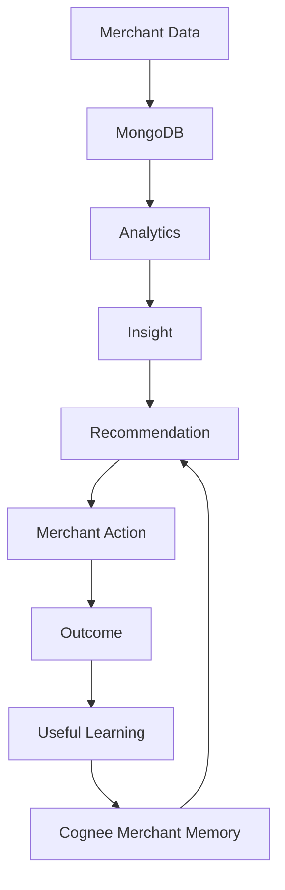

# GrowKaro — Cognee Merchant Business Memory Architecture (`docs/COGNEE.md`)

## 1. Why GrowKaro Uses Cognee

Traditional retail dashboards present static snapshots of transactions. However, an autonomous AI business partner must understand the **historical context, merchant preferences, and past campaign effectiveness** of a specific merchant over time.

GrowKaro incorporates **Cognee** as the merchant knowledge and semantic memory layer. Rather than treating every recommendation as an isolated prompt, Cognee enables GrowKaro to:
- Learn what campaign structures previously worked or underperformed.
- Remember merchant feedback and explicit campaign rejections so the AI does not repeat dismissed ideas.
- Provide continuous business context across multiple recommendation cycles.
- Ground LLM reasoning in verified historical outcomes rather than hallucinated assumptions.

---

## 2. What Cognee Stores

Cognee acts as the persistent semantic knowledge graph and memory layer. It stores **high-level business facts, learnings, and behavioral patterns**, specifically:
- **Merchant Preferences**: e.g., *"Merchant prefers combo promotions over direct margin cuts"*, *"Merchant avoids discounts exceeding 20%"*.
- **Accepted Action Patterns**: e.g., *"Lull-hour cold brew combos with WhatsApp dispatch achieved positive customer response"*.
- **Rejected Action Learnings**: e.g., *"Merchant rejected 15% flat discount on 2026-09-18 citing margin protection"*.
- **Measured Outcomes**: High-level synthesis of post-campaign evaluations (e.g., `+23.8% observed lift during 2 PM – 4:30 PM window`).
- **Ambient Business Context**: Peak days, weather sensitivity (e.g., *"Monsoon rains drive high demand for hot beverages and samosas"*).

Cognee does **NOT** store raw transactional logs, credit card numbers, or low-level operational queues.

---

## 3. What MongoDB Stores

MongoDB serves as the **single authoritative source of truth** for all structured transactional and operational application data:
- **Merchants**: Legal business profiles, store hours, categories, contact channels.
- **Transactions**: Individual receipt-level sales (~5,234 records across 90 days), timestamps, items, payment methods, totals.
- **Products**: Catalog, prices, cost of goods, category mappings, margin ratios.
- **Customers**: Pseudonymized phone numbers, total visits, lifetime spend, recency, cluster segmentation.
- **Actions & Campaigns**: State-machine execution states (`PENDING`, `APPROVED`, `EXECUTING`, `SUCCESS`, `REJECTED`), payloads, delivery statuses.
- **Notifications**: Alerts, read/unread states, priority levels, deep links.
- **Outcomes**: Mathematical baseline vs post-action telemetry deltas, confidence ratings, and timestamps.
- **Memory (Mirror Collection)**: Local MongoDB collection (`memories`) providing instantaneous query access, indexing, and offline resiliency.

---

## 4. Key Differences Between MongoDB and Cognee

| Dimension | MongoDB | Cognee |
| :--- | :--- | :--- |
| **Primary Role** | Authoritative System of Record | Semantic Memory & Knowledge Layer |
| **Data Nature** | Exact, tabular, raw transactional events | Conceptual facts, learnings, preferences |
| **Query Mechanism** | Aggregation pipelines, B-Tree index lookups | Semantic search, tag scoring, knowledge graph |
| **Access Latency** | Sub-5ms database queries | Graph/vector traversal (~50–200ms) |
| **Resilience Model** | Mandatory (App fails if DB is down) | Non-blocking (App degrades gracefully if down) |
| **Scope** | Complete system data | Curated merchant-level intelligence |

> [!NOTE]
> **Summary Roles**:
> - **MongoDB** = Authoritative application data & transactional state.
> - **Cognee** = AI memory, preference retention, and knowledge layer.
> - **Groq** = High-speed LLM reasoning engine (`qwen/qwen3.8-27b`).

---

## 5. How Merchant Memory is Created

GrowKaro creates memory entries through three deterministic events:
1. **System Seeding**: Initial curated operational baseline facts created via `backend/scripts/seed.js` for demo merchants (e.g., Cafe Aroma lull hours).
2. **Merchant Feedback / Rejection**: When a merchant rejects a proposed action in `ActionReviewModal.jsx`, `actionService.rejectAction()` captures the merchant's reason and writes a `type: 'preference'` memory fact.
3. **Autonomous Outcome Measurement**: When `outcomeService.measureActionOutcome()` finishes evaluating post-campaign telemetry, it extracts the business result and writes a `type: 'past_outcome'` memory fact.

All writes go through `memoryService.storeMemory(merchantId, memoryData)`.

---

## 6. How Memory is Retrieved

When an AI recommendation or copilot consultation is triggered:
1. `aiService.js` calls `memoryService.getRelevantMemoryContext(merchantId, topicQuery)`.
2. The service queries memory records for the specific `merchantId`.
3. Relevance scoring ranks memories by matching keywords and boosting high-value types:
   - Past outcomes (`type: 'past_outcome'`) receive a +1.5 relevance boost.
   - Merchant preferences (`type: 'preference'`) receive a +1.0 relevance boost.
4. The top 6 most relevant facts are formatted into a clean context string and injected into the Groq LLM prompt under `MERCHANT MEMORY (Cognee):`.

---

## 7. How Recommendations Use Memory

In `aiService.generateRecommendation()` and `recommendationService.js`:
- The Groq prompt includes the merchant's known memories.
- The system prompt explicitly instructs the LLM:
  > *"Adhere strictly to merchant memory and historical preferences. If the merchant previously rejected deep discounts, propose bundle or value-add strategies instead. Ground all proposals in past observed successes."*
- This ensures recommendations evolve as the merchant interacts with the system.

---

## 8. How Outcomes Update Memory

When an action completes and post-action telemetry is evaluated:
1. `outcomeService.js` computes baseline vs post metrics (revenue, orders, AOV).
2. If statistically meaningful, it constructs a synthesized learning string:
   ```text
   Action "Afternoon Cold Brew Combo" observed a +23.8% lift in afternoon revenue (baseline ₹3,240 -> observed ₹4,010).
   ```
3. It calls `memoryService.storeMemory()` with `type: 'past_outcome'`, tags `['campaign_outcome', 'afternoon_lull', 'cold_brew']`.
4. This learning is instantly available for all subsequent recommendations.

---

## 9. How Rejected Actions are Handled

When a merchant clicks `[Reject Proposal ✕]` in the UI:
1. The merchant enters an optional reason (e.g., *"Do not want to offer discounts on coffee drinks"*).
2. `actionService.rejectAction(merchantId, actionId, reason)` updates the action status to `REJECTED`.
3. It immediately invokes:
   ```javascript
   await memoryService.storeMemory(merchantId, {
     type: 'preference',
     key: `rejected_${actionId}`,
     content: `Merchant rejected action "${action.title}". Reason: ${reason}. Avoid repeating this specific promotion.`,
     tags: ['rejection', 'merchant_preference', action.channel.toLowerCase()],
     source: 'merchant_feedback'
   });
   ```
4. Future LLM generations retrieve this preference and actively avoid rejected promotion patterns.

---

## 10. How Memory is Scoped per Merchant

**Multi-tenant Isolation**:
- Every document in MongoDB's `memories` collection has an indexed `merchantId: { type: ObjectId, ref: 'Merchant', required: true }`.
- All queries in `memoryService.js` strictly enforce `{ merchantId }` scoping.
- Cafe Aroma's memories are never accessible to or blended with Style Studio or Kirana store prompts.
- When pushing to external Cognee, each request includes `merchantId: memory.merchantId.toString()`.

---

## 11. How Stale/Incorrect Memory is Handled

1. **Deterministic Upserting**: Memories use compound uniqueness `{ merchantId, key }`. Storing an updated insight on the same business issue (e.g., `lull_hour_strategy`) overwrites the previous entry rather than creating conflicting duplicates.
2. **Confidence Degradation**: Memories feature a `confidence` float (0.0 to 1.0) and `updatedAt` timestamps.
3. **Explicit Merchant Erasure**: Merchants can review and manage learned preferences via `GET /api/merchants/:id/memory`.

---

## 12. Error Handling if Cognee is Unavailable

Resilience is a primary design tenet:
- If the remote Cognee endpoint (`COGNEE_API_URL`) is unreachable, down, or times out:
  - `memoryService.syncWithCognee()` catches the error asynchronously with a 4-second timeout.
  - A non-blocking warning is logged: `[Cognee Remote Sync]: fetch failed`.
  - The local MongoDB memory mirror immediately serves all queries.
  - The merchant UI and AI copilot continue to function with 100% feature parity.
  - The system **never crashes** and never exposes raw connection errors to the merchant.

---

## 13. Environment Variables Required

In `backend/.env`:
```env
# Optional external Cognee instance
COGNEE_API_URL=https://cognee-instance.internal.net
COGNEE_API_KEY=your_cognee_api_key_here

# Groq LLM configuration for reasoning
GROQ_API_KEY=gsk_...
GROQ_MODEL=qwen/qwen3.8-27b
```
*(If `COGNEE_API_URL` is omitted or empty, GrowKaro automatically operates in local memory mirror mode using MongoDB).*

---

## 14. Current Implementation Status

| Feature | Status | Implementation Details |
| :--- | :--- | :--- |
| **Merchant Scoped Memory Schema** | **Active & Verified** | `backend/src/models/Memory.js` |
| **Memory Storage & Retrieval** | **Active & Verified** | `backend/src/services/memoryService.js` |
| **Rejection Learning Pipeline** | **Active & Verified** | `backend/src/services/actionService.js` |
| **Outcome Ingestion to Memory** | **Active & Verified** | `backend/src/services/outcomeService.js` |
| **Groq Prompt Memory Injection** | **Active & Verified** | `backend/src/services/aiService.js` |
| **Remote Cognee REST Sync** | **Ready (Non-blocking)** | Dual-mode: Local Mongo mirror + optional remote sync |

---

## 15. Demo Behavior

During the official Cafe Aroma demo presentation:
1. `npm run demo:reset` seeds Cafe Aroma with clean historical memory facts.
2. When the merchant reviews the Afternoon Cold Brew recommendation in `/campaigns`, the proposal reflects Cafe Aroma's known combo preference.
3. If the merchant approves and the outcome is measured, the activity feed at `/activity` logs:
   `🧠 Merchant memory updated with measured outcome.`
4. Subsequent Copilot queries in `/copilot` reference this past outcome when asked *"How did our afternoon campaign perform?"*.

---

## 16. Example Cafe Aroma Memory Lifecycle

```text
[Step 1: Baseline Seed]
Memory: "Cafe Aroma experiences recurring low footfall between 2:00 PM and 4:30 PM on weekdays."
Source: system_observed | Confidence: 1.0

[Step 2: Recommendation Generation]
LLM Prompt Ingests: Lull-hour fact + Afternoon Cold Brew combo opportunity.

[Step 3: Merchant Rejection Test]
Merchant Rejects 15% discount.
Memory Created: "Merchant rejected 15% discount. Prefers bundle offers over price cuts."
Source: merchant_feedback | Confidence: 1.0

[Step 4: Campaign Execution & Measurement]
Afternoon Cold Brew Combo executes and completes.
Outcome calculated: +23.8% observed afternoon revenue.
Memory Created: "Afternoon Cold Brew Combo observed +23.8% lift. Effective strategy for lull hours."
Source: system_observed | Confidence: 0.95

[Step 5: Future Recommendation]
Next week's Copilot advisory: Proposes seasonal pastry pairing citing the proven Cold Brew combo model.
```

---

## 17. Exact Source Files Involved

- `backend/src/models/Memory.js`: Mongoose schema for business memory facts.
- `backend/src/services/memoryService.js`: CRUD, tag scoring, and Cognee sync logic.
- `backend/src/services/aiService.js`: Groq reasoning engine injecting memory into prompts.
- `backend/src/services/actionService.js`: Captures merchant rejections into memory.
- `backend/src/services/outcomeService.js`: Extracts outcome learnings into memory.
- `backend/src/controllers/merchantController.js`: Exposes `GET /api/merchants/:id/memory`.
- `frontend/src/pages/AICopilot.jsx`: Displays memory provenance in assistant responses.

---

## 18. How to Test Cognee

Run the dedicated test suite:
```bash
cd e:\GrowKaro\backend
node tests/verify_phase4_end_to_end.js
```
Specifically tests:
- `Test 35: Rejection captures reason in Merchant Memory`
- `Test 42: Outcome updates Merchant Memory`
- `Test 43: Memory context retrieval ranks past outcomes`

Manual API verification:
```bash
# Retrieve memories for Cafe Aroma
curl http://localhost:5000/api/merchants/6aad4ddea3570e25fb6f5bca/memory
```

---

## 19. Known Limitations

1. **Remote Sync is Best-Effort**: When running without an active self-hosted Cognee Docker instance, GrowKaro relies on its local MongoDB vector/keyword mirror. This maintains 100% application stability but does not build external neo4j/qdrant knowledge graphs.
2. **Semantic Matching**: In offline/local mode, memory retrieval utilizes multi-term keyword and category scoring rather than embedding distance calculations.

---

## Architecture Diagram


