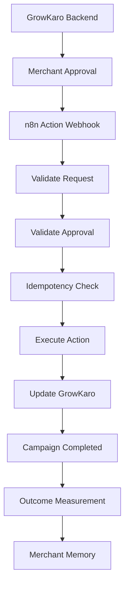

# GrowKaro — Final n8n Build & Integration Specification (`docs/FINAL_N8N_BUILD.md`)

## 1. Purpose of n8n in GrowKaro

**n8n** serves as the **Autonomous Automation & Workflow Execution Engine** for GrowKaro. While GrowKaro's core Express backend and Groq LLM specialize in telemetry observation, anomaly detection, and recommendation generation, n8n handles the external operational execution:
- Dispatching promotional campaigns across merchant channels (WhatsApp Business, SMS, Email).
- Managing multi-step branching workflows, retries, and rate limits.
- Reporting execution progress and delivery receipts back to GrowKaro via authenticated callbacks.

---

## 2. Why GrowKaro Uses n8n

1. **Decoupled Architecture**: Separates merchant business intelligence from multi-channel delivery mechanics.
2. **Visual Workflow Orchestration**: Enables non-engineering operators to inspect, adjust, and audit external campaign delivery pipelines without redeploying backend code.
3. **Pluggable Integration Ecosystem**: Simplifies connecting to varied Indian merchant delivery gateways (Gupshup, Twilio, Meta Cloud API, SendGrid) without bloating the core Node.js server.
4. **Resilient Asynchronous Execution**: Handles external API downtime, delays, and exponential backoff independently of the merchant web interface.

---

## 3. n8n's Responsibility

- Receiving approved campaign execution requests via HTTP webhook.
- Validating the incoming payload schema and authentication headers.
- Formatting channel-specific templates (e.g., WhatsApp interactive buttons, SMS shortlinks).
- Dispatching messages to customer recipient lists.
- Collecting delivery receipts and tracking metrics (sent, delivered, read).
- Sending an HTTP callback status update to GrowKaro's `/api/n8n/webhook/action-status` endpoint.

---

## 4. GrowKaro Backend's Responsibility

- **Telemetry & Grounding**: Querying MongoDB transactions, customer RFM clusters, and store hours.
- **Intelligence & Anomaly Detection**: Identifying business issues (e.g., afternoon revenue drop, product margin decline).
- **Merchant Approval Gate**: Creating action drafts in `PENDING` status and strictly enforcing merchant sign-off before dispatch.
- **State Machine Enforcement**: Transitioning actions across `PENDING` -> `APPROVED` -> `EXECUTING` -> `SUCCESS` / `FAILED`.
- **Attribution & Outcome Measurement**: Deterministically evaluating post-campaign financial uplift and ingesting learnings into Cognee memory.

---

## 5. Action Workflow

The lifecycle of an action through the n8n integration follows this strict pipeline:
1. **Detection**: `growthDetectorService.js` detects a business anomaly (e.g., Cafe Aroma afternoon lull).
2. **Recommendation**: `recommendationService.js` generates an action draft with specific copy and channel configuration.
3. **Draft Creation**: `actionService.createDraft()` saves the action in MongoDB with `approvalStatus: 'PENDING'`.
4. **Merchant Notification**: Notification center alerts the merchant with a deep link to `/campaigns`.
5. **Merchant Review**: Merchant inspects the proposal, edits copy if desired, and clicks `[Approve & Launch ⚡]`.
6. **Execution Trigger**: `actionService.approveAndExecuteAction()` marks `approvalStatus: 'APPROVED'`, `executionStatus: 'EXECUTING'`, and triggers `n8nService.executeActionWorkflow()`.
7. **Delivery & Callback**: n8n processes the payload and returns execution verification.
8. **Completion & Measurement**: Action transitions to `SUCCESS`, creates an execution notification, and schedules outcome evaluation.

---

## 6. Approval Gate Enforcement

**Mandatory Security Rule**: No action can execute without explicit merchant approval.
- In `backend/src/services/actionService.js`:
  ```javascript
  if (action.approvalStatus !== 'APPROVED') {
    throw new Error(`Cannot execute action with status ${action.approvalStatus}. Explicit merchant approval is mandatory.`);
  }
  ```
- Any attempt to invoke execution on an action that is `PENDING`, `REJECTED`, or `CANCELLED` is blocked with HTTP 400.
- Voice commands also route through this gate via a mandatory client-side confirmation modal before calling the approve endpoint.

---

## 7. Simulation Mode (`N8N_MODE=demo`)

GrowKaro includes a first-class **Simulation Sandbox** designed specifically for hackathons, evaluators, and offline environments:
- **No External Dependencies**: Works out-of-the-box without requiring an active n8n cloud or Docker instance.
- **Identical State Transitions**: The simulation exercises the exact same backend state machine, database updates, notification triggers, and outcome measurements as real execution.
- **Realistic Dispatch Simulation**: Simulates channel delivery latency (150ms), computes realistic audience sizes based on active customer clusters, and generates an internal execution reference (`sim_n8n_...`).
- **Clean UI Presentation**: The merchant-facing interface hides raw technical IDs and displays `"Automated via n8n"`, with technical execution IDs safely collapsed inside `<details>`.

---

## 8. Real Mode (`N8N_MODE=real`)

When configured for live production:
- Set `N8N_MODE=real` and provide `N8N_WEBHOOK_URL=https://your-n8n.com/webhook/growkaro-action` in `.env`.
- `n8nService.js` dispatches an authenticated HTTP POST request to the webhook with a 10-second timeout.
- **Fail-Fast Error Reporting**: If the external n8n instance is offline or returns an error, the backend captures the exact HTTP error, marks `executionStatus: 'FAILED'`, and sets `failureReason`. It **never disguises failures as fake successes**.

---

## 9. Callback Flow

1. n8n workflow executes the channel delivery nodes.
2. Upon completion, n8n issues an HTTP POST to:
   ```text
   POST http://localhost:5000/api/n8n/webhook/action-status
   ```
3. Headers:
   ```text
   X-GrowKaro-Secret: <N8N_WEBHOOK_SECRET>
   Content-Type: application/json
   ```
4. Payload:
   ```json
   {
     "actionId": "664f1a2b...",
     "executionId": "n8n_exec_987654",
     "status": "SUCCESS",
     "message": "Dispatched to 35 customers via WhatsApp API"
   }
   ```
5. `actionController.handleN8nWebhook()` validates the shared secret, updates the Action in MongoDB, updates the Campaign record, and emits an `ACTION_COMPLETED` notification.

---

## 10. Execution States

```text
[Draft Created]
approvalStatus: PENDING
executionStatus: PENDING

      │ (Merchant clicks "Approve & Launch")
      ▼
[Approval Gate Passed]
approvalStatus: APPROVED
executionStatus: EXECUTING

      │ (n8n Webhook / Simulation completes)
      ▼
[Execution Successful]
approvalStatus: APPROVED
executionStatus: SUCCESS
completedAt: <Timestamp>

      │ (If error or external failure occurs)
      ▼
[Execution Failed]
approvalStatus: APPROVED
executionStatus: FAILED
failureReason: "External provider timeout"
```

---

## 11. Idempotency & Duplicate Protection

To protect merchants against duplicate charges or repeated WhatsApp blasts:
1. **Status Lock**: If `action.executionStatus === 'EXECUTING'` or `'SUCCESS'`, subsequent approval calls return the existing record immediately without re-triggering n8n.
2. **Deterministic Campaign Linking**: Every executed action creates exactly one Campaign record linked by `actionId`.
3. **Demo Reset Idempotency**: `npm run demo:reset` clears previous execution artifacts cleanly, ensuring the starting presentation state always has exactly 1 pending action and 1 completed baseline campaign.

---

## 12. Error Handling & Resilience

- **Timeout Protection**: All outbound webhook calls use `AbortSignal.timeout(10000)` (10 seconds).
- **Callback Secret Verification**: Callbacks missing or presenting an invalid `X-GrowKaro-Secret` are rejected with HTTP 401.
- **Graceful Retries**: Failed actions can be retried via `POST /api/actions/:id/retry` once network connectivity is restored.
- **Merchant Transparency**: In the event of failure, the UI clearly displays `"Execution Failed"` with the sanitized reason, without breaking the application dashboard.

---

## 13. Notification Integration

The n8n lifecycle triggers 3 automated notifications via `notificationService.js`:
1. `ACTION_REQUIRED`: Emitted when the recommendation engine identifies a high-priority opportunity requiring sign-off.
2. `ACTION_COMPLETED`: Emitted when n8n successfully finishes campaign delivery (`"Campaign [Title] has completed automation"`).
3. `OUTCOME_MEASURED`: Emitted when post-campaign telemetry is evaluated (`"Observed change: +23.8%"`).

---

## 14. Daily Business Brief Workflow

Located at `backend/n8n/growkaro-daily-brief-workflow.json`:
- **Trigger**: Schedule Trigger node set to `0 8 * * *` (8:00 AM IST daily).
- **Flow**: Fetches all active merchants from `GET /api/merchants`, then calls `GET /api/ai/brief/:merchantId` for each.
- **Status in Demo**: This workflow file is provided as a **production-ready JSON blueprint** for deployment in standalone n8n instances. In the hackathon demo environment, the Daily Business Brief can also be triggered on-demand via the Developer Demo Controller (`/demo-control`) or `backend/src/services/simulatorService.js`.

---

## 15. Environment Variables

```env
# n8n Orchestration Settings
N8N_MODE=demo                                # 'demo' (simulation) or 'real' (live webhook)
N8N_BASE_URL=http://localhost:5678           # Base URL of n8n server
N8N_WEBHOOK_URL=                             # Live n8n webhook URL (e.g. http://localhost:5678/webhook/growkaro-action)
N8N_WEBHOOK_SECRET=growkaro-secure-key-2026  # Shared secret for callback authentication
N8N_API_KEY=                                 # Optional n8n API key
BACKEND_URL=http://localhost:5000            # Callback target for n8n
```

---

## 16. Workflow Names & Metadata

1. **Campaign Execution Workflow**:
   - Name: `GrowKaro — Action Execution Workflow`
   - Target: WhatsApp / SMS / Email merchant marketing campaigns
2. **Daily Business Brief Workflow**:
   - Name: `GrowKaro — Daily Business Brief Workflow`
   - Target: Morning merchant briefing aggregation

---

## 17. Workflow Files

- Blueprint 1: `backend/n8n/growkaro-action-workflow.json` (91 lines, JSON format)
- Blueprint 2: `backend/n8n/growkaro-daily-brief-workflow.json` (67 lines, JSON format)

---

## 18. Webhook Endpoints

- **Outbound Webhook** (GrowKaro -> n8n):
  - Configured in `N8N_WEBHOOK_URL`
  - Method: `POST`
- **Inbound Callback** (n8n -> GrowKaro):
  - URL: `http://localhost:5000/api/n8n/webhook/action-status`
  - Method: `POST`

---

## 19. Expected Request Payload (GrowKaro -> n8n)

```json
{
  "actionId": "664f1a2b3c4d5e6f7a8b9c0d",
  "merchantId": "6aad4ddea3570e25fb6f5bca",
  "merchantName": "Cafe Aroma",
  "merchantType": "cafe",
  "city": "Mumbai",
  "type": "LULL_HOUR_CAMPAIGN",
  "title": "☕ Afternoon Cold Brew & Pastry Combo",
  "channel": "WHATSAPP",
  "targetAudience": "Afternoon regulars and nearby walk-ins",
  "timing": "2:00 PM – 4:30 PM",
  "payload": {
    "headline": "Beat the 3 PM Slump at Cafe Aroma! ☕❄️",
    "body": "Pair your favorite Cold Brew with our fresh Butter Croissant for just ₹249 between 2 PM and 4:30 PM today.",
    "cta": "Claim Afternoon Combo",
    "offer": "Cold Brew + Croissant at ₹249"
  },
  "approvedAt": "2026-09-19T11:00:00.000Z",
  "callbackUrl": "http://localhost:5000/api/n8n/webhook/action-status"
}
```

---

## 20. Expected Callback Payload (n8n -> GrowKaro)

```json
{
  "actionId": "664f1a2b3c4d5e6f7a8b9c0d",
  "executionId": "n8n_live_1726729200",
  "status": "SUCCESS",
  "message": "Workflow successfully triggered and executed via n8n engine.",
  "deliveryStats": {
    "estimatedAudience": 35,
    "sentCount": 35,
    "deliveredCount": 34,
    "readCount": 28
  }
}
```

---

## 21. Demo Execution Behavior

During presentation mode:
1. When merchant approves in `ActionReviewModal.jsx`, frontend sends `POST /api/actions/:id/approve`.
2. `n8nService.js` detects `N8N_MODE=demo`.
3. Generates simulation callback with realistic delivery stats (35 recipients, 34 delivered).
4. Creates a Campaign document in MongoDB.
5. In the UI, the Campaign appears with `"Automated via n8n"`.
6. Technical metadata (`sim_n8n_...`) is hidden inside `<details><summary>Technical Details</summary>`.

---

## 22. Real vs Simulation Distinction

| Feature | Real Mode (`N8N_MODE=real`) | Simulation Mode (`N8N_MODE=demo`) |
| :--- | :--- | :--- |
| **External Network Call** | Real HTTP POST to n8n server | In-process simulation callback |
| **WhatsApp Delivery** | Dispatches via Meta/Gupshup API | Mathematically simulated audience |
| **Requires Running n8n** | Yes (Cloud / Docker) | No (Completely self-contained) |
| **Backend State Machine** | Real (`PENDING` -> `SUCCESS`) | Real (`PENDING` -> `SUCCESS`) |
| **Database Records** | Real Action & Campaign models | Real Action & Campaign models |
| **Outcome Measurement** | Real historical telemetry delta | Real historical telemetry delta |
| **Memory Ingestion** | Full Cognee memory learning | Full Cognee memory learning |

---

## 23. Security Considerations

1. **Zero Hardcoded Secrets**: All webhook URLs and API keys reside in `.env`.
2. **Callback Authentication**: Inbound callbacks must present the valid `X-GrowKaro-Secret` header.
3. **Approval Verification**: Backend rejects any direct execution request if `approvalStatus !== 'APPROVED'`.
4. **Sanitized Logs**: No customer phone numbers or access credentials are logged to console.

---

## 24. Testing Instructions

### Automated End-to-End Suite
```bash
cd e:\GrowKaro\backend
node tests/verify_phase4_end_to_end.js
```
Verifies:
- `Test 20: Dual mode n8n service reports mode correctly`
- `Test 21: Real mode fails fast when webhook URL missing`
- `Test 22: Demo mode executes and transitions action to SUCCESS`
- `Test 24: Unapproved action execution blocked (Approval Gate)`
- `Test 26: Webhook callback validates secret`

---

## 25. Troubleshooting

- **Error: "Cannot execute action with status PENDING"**: The action has not been approved. Call `/api/actions/:id/approve` first.
- **Error: "Real n8n mode is active, but N8N_WEBHOOK_URL is not configured"**: Switch `N8N_MODE=demo` in `backend/.env` or configure the webhook URL.
- **Error: "Invalid webhook secret"**: Verify that `X-GrowKaro-Secret` header in n8n matches `N8N_WEBHOOK_SECRET` in `backend/.env`.

---

## 26. Exact Presentation Workflow

1. Start with clean demo state: `npm run demo:reset`.
2. Open Dashboard (`http://localhost:5173/dashboard`).
3. Point out Notification 🔔 (`Action Required: Afternoon Lull`).
4. Click `[Review & Approve ›]` to open the Action Review Modal.
5. Highlight the 4 sections: **WHY**, **EVIDENCE**, **RECOMMENDATION**, and **ACTION**.
6. Click `[Approve & Launch ⚡]`.
7. Observe instantaneous transition to `"Automated via n8n"`.
8. Navigate to `/activity` to show the complete chronological audit trail.

---

## Orchestration Architecture


